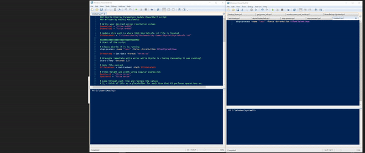
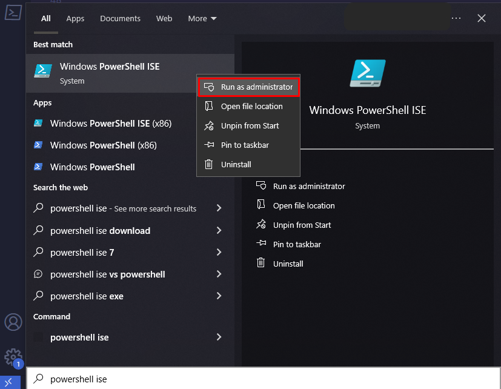
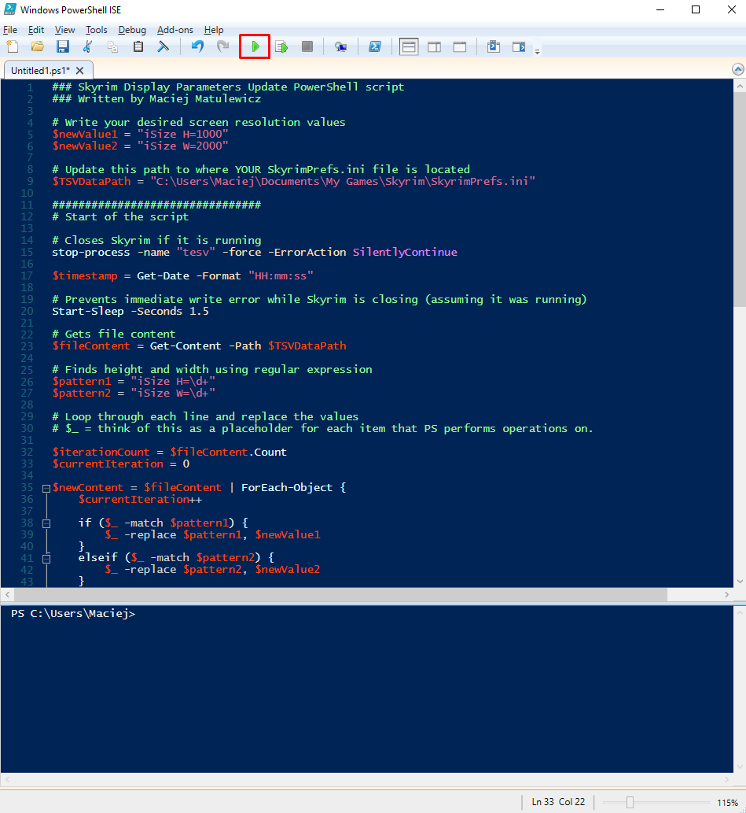
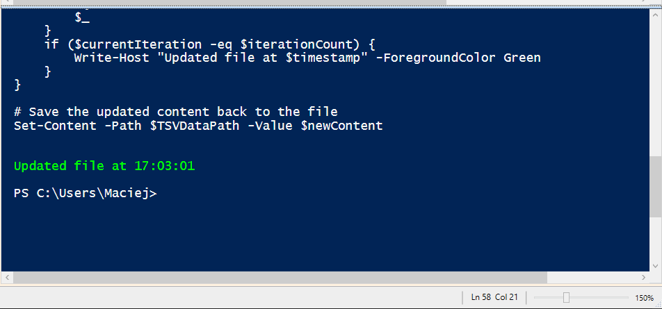

# Skyrim Display Parameters Update PowerShell Script

## Table of Contents

- [What is this update script for?](#what-is-this-update-script-for)
- [How to use the script?](#how-to-use-the-script)
- [FAQ](#faq)
- [Step-by-step guide](#step-by-step-guide)

## Demo



## What is this update script for?

This script is used to streamline the process of updating the display parameters `height` and `width` inside the SkyrimPrefs.ini file.

## How to use the script?

To use the script, you preferably will have admin rights for your user account, otherwise you'll need to run PowerShell ISE as an administrator.

First, open PowerShell ISE as an administrator.

Copy and paste the PowerShell code into the PowerShell ISE scripting window.

Next, you will need to update the following:

```
# Update the below path to where YOUR SkyrimPrefs.ini is located
$TSVDataPath = "C:\Users\xxx\Documents\My Games\Skyrim\SkyrimPrefs.ini"

# Replace 1000 and 2000 with desired values
$newValue1 = "iSize H=1000"
$newValue2 = "iSize W=2000"
```

Run the script or press <kbd>F5</kbd> on your keyboard.

## FAQ

### Why not change the resolution via normal settings?

The reason I created this script is because I travel between places and have to adjust my Skyrim resolution depending on where I am, as I have different monitor and desk setups.

It is very long and tedious to update it to a custom value, which I always use, while playing in windowed mode.

I never play in full screen mode because switching often messes up my other windows, programs, turns off Night Light, and scales windows incorrectly.

### Script is not working?

Ensure you ran the script with admin rights (right click on PowerShell ISE -> Run as Administrator)

Ensure "Read-Only" option is disabled on the `SkyrimPrefs.ini` file (right click and untick the box that says Read-Only).

Ensure your path to the `SkyrimPrefs.ini` is correct. The entire path must be copied as is between the " ".

For example, "C:\Users\YOUR_USER_PROFILE\Documents\My Games\Skyrim\SkyrimPrefs.ini".

### Does the script change window mode?

Yes, the script changes the window mode from Full Screen to Windowed.

## Step-by-step guide

Open PowerShell ISE from Windows Start Menu as admin.



Paste the script into the upper window of PowerShell ISE. Next, **update the $TSVDataPath, $newValue1, and $newValue1** and then press the green arrow or <kbd>F5</kbd> to run the script.


If successful, you should see the "Updated file" with the current time.


